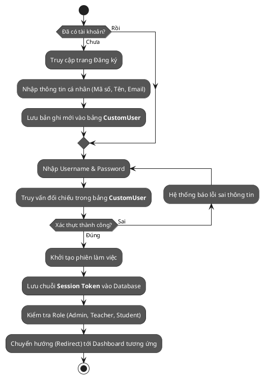
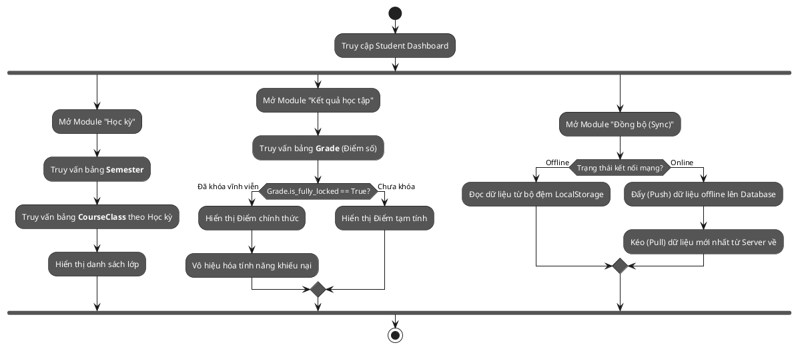
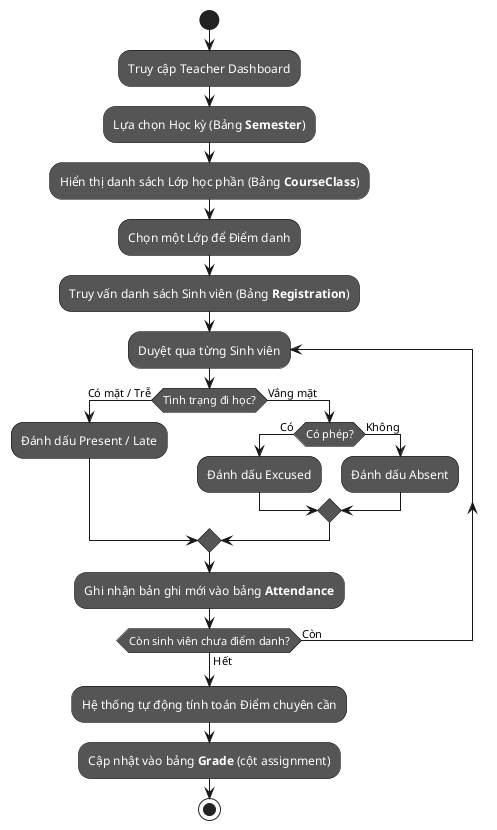
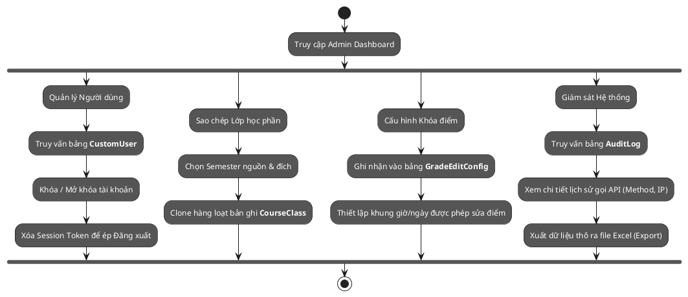

# Sơ đồ Hoạt động (Activity Diagrams) cho các Thực thể Hệ thống (UniMS)

Tài liệu này cung cấp các **UML Activity Diagram** (sử dụng cú pháp PlantUML Activity Beta) mô phỏng chi tiết hành trình xử lý nghiệp vụ của từng Entity cốt lõi trong cơ sở dữ liệu.

---

### 1. Entity: CustomUser (Luồng Xác thực - Auth Flow)
Bao gồm các chức năng cốt lõi liên quan đến bảng `CustomUser` như Đăng ký (Register), Đăng nhập (Login), và Quản lý Phiên (Session).

---

### 2. Entity: Student & Registration (Luồng Sinh viên)
Hành trình tương tác của Sinh viên với các bảng dữ liệu `Student`, `Semester`, `CourseClass`, `Registration`, và `Grade`.

---

### 3. Entity: Teacher & Attendance (Luồng Giảng viên)
Hành trình của Giảng viên thao tác với các bảng `Teacher`, `CourseClass`, và đặc biệt là ghi nhận `Attendance` (Điểm danh).

---

### 4. Entity: Admin, GradeEditConfig & AuditLog (Luồng Quản trị viên)
Hành trình của Admin quản trị toàn bộ các tác vụ liên quan đến Cấu hình hệ thống, Log bảo mật, và Dữ liệu hàng loạt.

