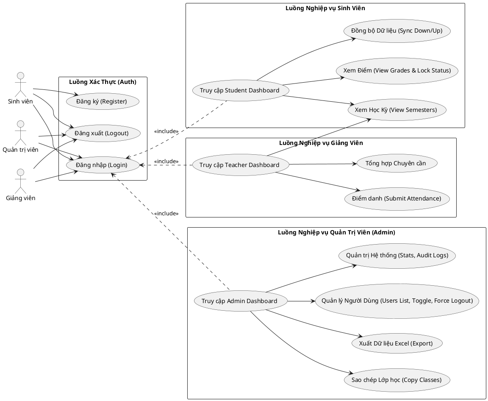
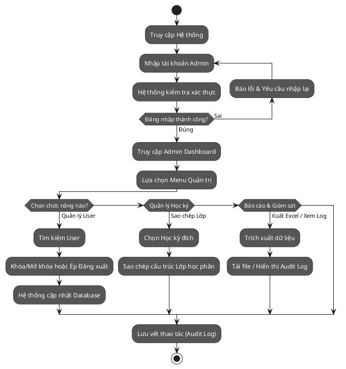
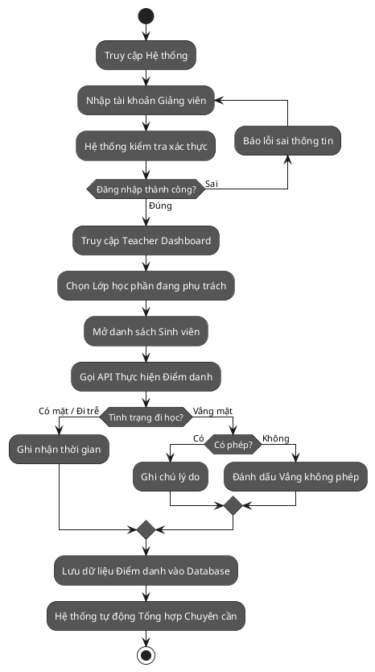
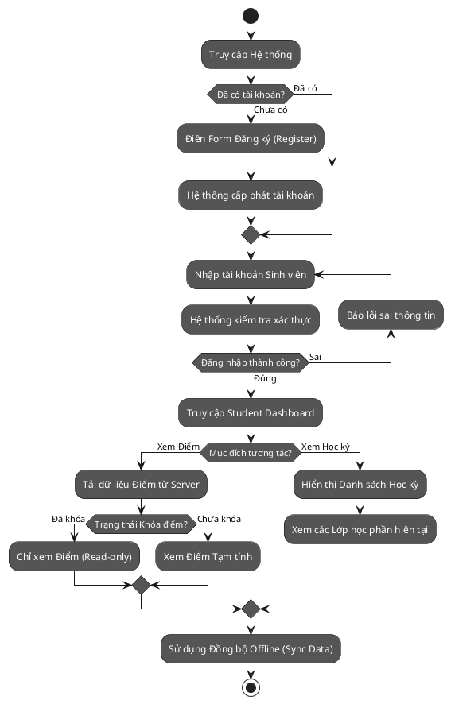

# Báo cáo Phân tích Hệ thống Student Management (UniMS)

## YÊU CẦU 1: PHÂN TÍCH VÀ VẼ BIỂU ĐỒ USE CASE (CHI TIẾT THEO LUỒNG NGHIỆP VỤ)

### 1. Phân tích Actors và Các cụm Use Cases (Modules)
Dựa vào kiến trúc hệ thống và Front-End Views, các chức năng được phân rã theo luồng nghiệp vụ của từng đối tượng (Actor) thay vì liệt kê phẳng:

**1. Sinh viên (Student):**
- **Luồng Đăng nhập (Auth Flow):** Sinh viên -> Đăng nhập (Login) -> Truy cập Sinh viên Dashboard.
- **Từ Dashboard Sinh viên:**
  - Xem kết quả học tập (Grades) & Trạng thái khóa điểm (Grade Lock Status)
  - Xem danh sách học kỳ (Semesters)
  - Đồng bộ dữ liệu cá nhân (Sync Data)

**2. Giảng viên (Teacher):**
- **Luồng Đăng nhập:** Giảng viên -> Đăng nhập (Login) -> Truy cập Giảng viên Dashboard.
- **Từ Dashboard Giảng viên:**
  - Thực hiện điểm danh sinh viên (Submit Attendance)
  - Tổng hợp điểm chuyên cần (Summarize Attendance)
  - Xem thông tin học phần/học kỳ.

**3. Quản trị viên (Admin):**
- **Luồng Đăng nhập:** Admin -> Đăng nhập (Login) -> Truy cập Admin Dashboard.
- **Từ Admin Dashboard, quản trị viên có thể điều hướng đến:**
  - **Quản lý dữ liệu:** Sao chép cấu trúc lớp học (Copy Classes), Xuất dữ liệu ra Excel (Export).
  - **Quản trị hệ thống:** Xem thống kê hệ thống (Stats), Xem nhật ký bảo mật (Audit Logs).
  - **Quản lý người dùng:** Quản lý danh sách User, Cưỡng chế đăng xuất (Force Logout), Khóa/Mở khóa User (Toggle Active Status).

### 2. Biểu đồ Use Case (PlantUML)

### 3. Giải thích luồng nghiệp vụ
Sơ đồ trên được cấu trúc theo mô hình **Luồng phân cấp (Hierarchical Flow)**, trong đó:
- Chức năng **Đăng nhập (Login)** là tiền đề (thể hiện qua quan hệ `<<include>>`). Không một Actor nào có thể truy cập các Dashboard nếu chưa xác thực thành công.
- Sau khi vào được **Dashboard** tương ứng với Role của mình, các nghiệp vụ mới rẽ nhánh. Ví dụ: Sinh viên vào Dashboard rồi mới có thể Xem điểm; Giảng viên vào Dashboard rồi mới gọi API Điểm danh.

---

## YÊU CẦU 2: XÂY DỰNG MÔ HÌNH TOÁN HỌC (MATHEMATICAL MODEL)

### 1. Định nghĩa các tập hợp
- **Tập hợp Người dùng (Users):**
  $$U = \{u_{admin}, u_{teacher}, u_{student}\}$$
- **Tập hợp Chức năng (Functions/Use cases):**
  - Nhóm Auth: $F_{auth} = \{f_{login}, f_{logout}\}$
  - Nhóm Student: $F_{student} = \{f_{s\_dash}, f_{s\_grades}, f_{s\_semesters}, f_{s\_sync}\}$
  - Nhóm Teacher: $F_{teacher} = \{f_{t\_dash}, f_{t\_attendance}, f_{t\_summarize}\}$
  - Nhóm Admin: $F_{admin} = \{f_{a\_dash}, f_{a\_manage\_users}, f_{a\_system}, f_{a\_copy}, f_{a\_export}\}$
  
  Tổng hợp hàm: $F = F_{auth} \cup F_{student} \cup F_{teacher} \cup F_{admin}$

- **Tập hợp Trạng thái và I/O:**
  - $S_{token}: U \rightarrow \{0, 1\}$ (Hàm trạng thái Session: 1 nếu Token hợp lệ, 0 nếu không)
  - $I$: Tập hợp dữ liệu đầu vào.
  - $O$: Tập hợp phản hồi đầu ra ($O_{success}, O_{401\_unauthorized}, O_{403\_forbidden}$).

### 2. Ma trận phân quyền (Role-based Access Control Mapping)
Hàm ánh xạ $R: U \times F \rightarrow \{0, 1\}$ (1: Access Granted, 0: Access Denied).
Thay vì viết ma trận dài, ta định nghĩa logic như sau để tuân thủ luồng phân cấp:
- $R(u_{admin}, f_i) = 1, \forall f_i \in F$ (Admin được truy cập tất cả)
- $R(u_{teacher}, f_i) = \begin{cases} 1 & \text{if } f_i \in F_{auth} \cup F_{teacher} \cup \{f_{s\_semesters}, f_{s\_sync}\} \\ 0 & \text{otherwise} \end{cases}$
- $R(u_{student}, f_i) = \begin{cases} 1 & \text{if } f_i \in F_{auth} \cup F_{student} \\ 0 & \text{otherwise} \end{cases}$

### 3. Mô tả luồng điều kiện (Logic vị từ) phản ánh sự phụ thuộc
Để phản ánh việc phải qua **Login/Dashboard** mới thực hiện được nghiệp vụ:

**Chức năng 1: Điểm danh của Giảng viên ($f_{t\_attendance}$)**
Một giáo viên chỉ điểm danh được khi thỏa mãn 2 điều kiện: Có Role hợp lệ VÀ đã đăng nhập ($S_{token} = 1$).
Cho user $u_i \in U$ cung cấp input $I_{data}$:
$$ f_{t\_attendance}(u_i, I_{data}) = \begin{cases} 
O_{success} & \text{if } R(u_i, f_{t\_attendance}) = 1 \land S_{token}(u_i) = 1 \\ 
O_{403\_forbidden} & \text{if } R(u_i, f_{t\_attendance}) = 0 \land S_{token}(u_i) = 1 \\ 
O_{401\_unauthorized} & \text{if } S_{token}(u_i) = 0 
\end{cases} $$

**Chức năng 2: Quản lý người dùng của Admin ($f_{a\_manage\_users}$)**
Được truy cập từ Admin Dashboard, chỉ cấp phép nếu user mang đặc quyền cao nhất.
Cho user $u_i \in U$ thực hiện request $I_{req}$:
$$ f_{a\_manage\_users}(u_i, I_{req}) = \begin{cases} 
O_{success} & \text{if } u_i = u_{admin} \land S_{token}(u_i) = 1 \\ 
O_{403\_forbidden} & \text{if } u_i \neq u_{admin} \land S_{token}(u_i) = 1 \\ 
O_{401\_unauthorized} & \text{if } S_{token}(u_i) = 0 
\end{cases} $$

### 4. Lưu đồ Nghiệp vụ Thực tế cho từng Tác nhân (Business Process / User Journey Flowcharts)

Để người dùng cuối có thể dễ dàng đọc hiểu luồng hoạt động thực tế (thay vì luồng kiểm tra bảo mật ở mức hệ thống), dưới đây là các lưu đồ nghiệp vụ (User Journey) thể hiện chi tiết hành trình từ lúc người dùng tương tác đến khi kết thúc quy trình.

#### 4.1. Luồng Nghiệp vụ: Quản trị viên (Admin)
Mô phỏng hành trình quản trị hệ thống, thao tác với người dùng và dữ liệu.

#### 4.2. Luồng Nghiệp vụ: Giảng viên (Teacher)
Mô phỏng hành trình giảng viên truy cập lớp học phần và thực hiện tác vụ chuyên môn (như Điểm danh).

#### 4.3. Luồng Nghiệp vụ: Sinh viên (Student)
Mô phỏng hành trình Sinh viên tham gia vào hệ thống để tra cứu thông tin học tập của chính mình.

