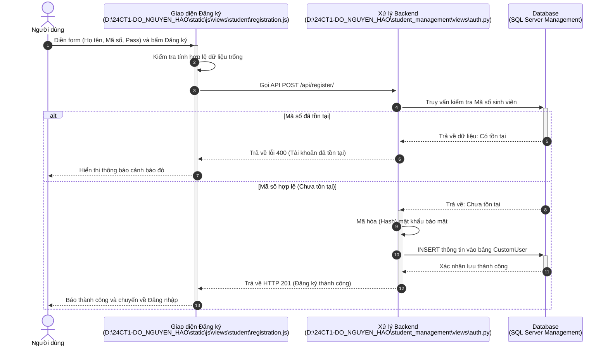
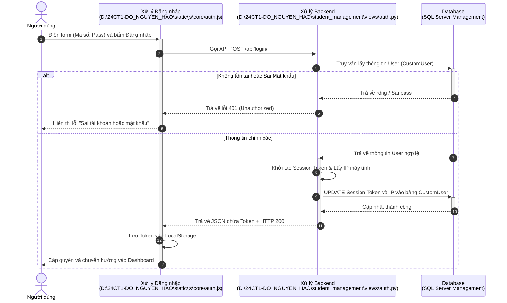
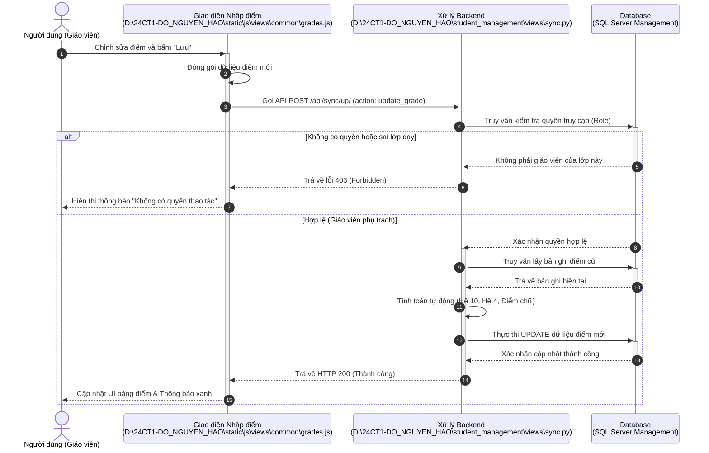
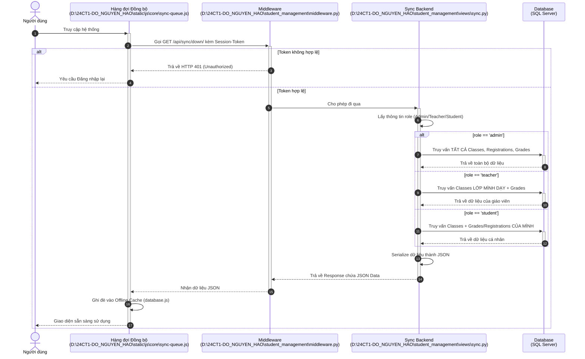

# BIỂU ĐỒ TUẦN TỰ (CHUẨN UML & ĐƯỜNG DẪN FILE TRỰC TIẾP)

> **CÁCH VẼ TỰ ĐỘNG TRÊN DIAGRAMS.NET (DRAW.IO):**
> 1. Trên thanh menu chọn: **Arrange** -> **Insert** -> **Advanced** -> **Mermaid...**
> 2. Copy đoạn code bên dưới chữ ````mermaid` của từng chức năng và dán vào hộp thoại.
> *(Các biểu đồ đã được cập nhật đường dẫn tuyệt đối (ổ đĩa D:) trỏ thẳng tới các file Frontend/Backend tương ứng)*

---

## 1. Biểu đồ Tuần tự: Chức năng Đăng ký



---

## 2. Biểu đồ Tuần tự: Chức năng Đăng nhập



---

## 3. Biểu đồ Tuần tự: Chức năng Nhập điểm (Có phân quyền theo Role)



---

## 4. Biểu đồ Tuần tự: Luồng Đồng bộ Dữ liệu (Sync Down)


