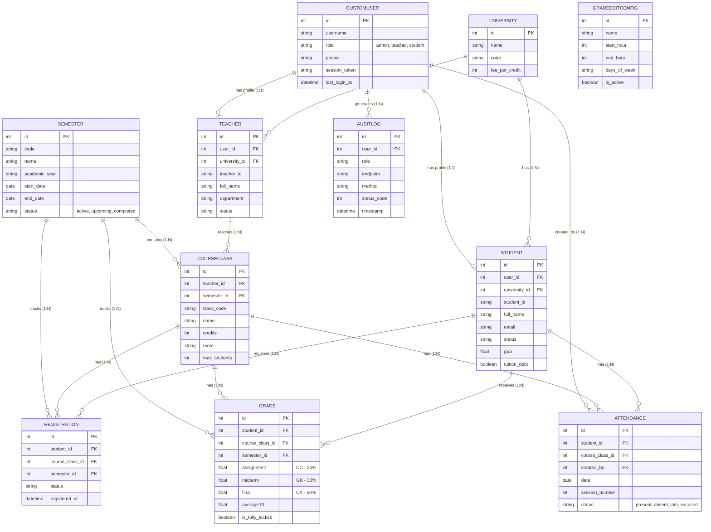

# Mô hình Cơ sở dữ liệu (Entity Relationship Diagram)

Dưới đây là sơ đồ thực thể liên kết (ERD) được trích xuất từ các Models chính của hệ thống Student Management (UniMS). Sơ đồ được vẽ bằng cú pháp **Mermaid**.

### Sơ đồ ERD (Mermaid)

### Giải thích các Mối quan hệ chính:
- **CustomUser (Người dùng):** Đóng vai trò là tài khoản đăng nhập chung. Bảng này có quan hệ `1:1` với `Student` hoặc `Teacher`. Mỗi Sinh viên hoặc Giảng viên sẽ liên kết tới 1 User.
- **Semester (Học kỳ):** Là mốc thời gian cốt lõi. Lớp học phần (`CourseClass`), Đăng ký học (`Registration`) và Bảng điểm (`Grade`) đều liên kết trực tiếp với Học kỳ để dễ dàng truy xuất dữ liệu theo mùa vụ.
- **CourseClass (Lớp học phần):** Do `Teacher` giảng dạy. Nó chứa danh sách các sinh viên tham gia thông qua `Registration`. Điểm số (`Grade`) và Điểm danh (`Attendance`) được đánh giá dựa trên sự kết hợp giữa `Student` và `CourseClass`.
- **AuditLog:** Ghi lại vết truy cập hệ thống, liên kết trực tiếp với `CustomUser`.
